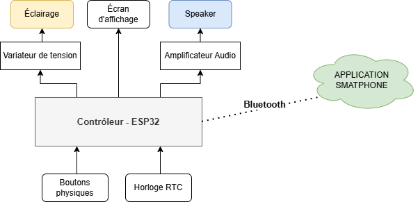

# AuroraWake

> Un réveil intelligent qui accompagne progressivement le réveil au lieu de le brusquer.

AuroraWake est un projet de réveil lumineux et sonore conçu pour rendre le réveil plus naturel. L'appareil adapte progressivement l'intensité de sa lumière et, si nécessaire, ajoute un son doux à l'heure choisie.

## Objectifs

- Réduire les réveils brusques et désagréables.
- Utiliser une lumière progressive comme signal principal de réveil.
- Garder une expérience simple, silencieuse et respectueuse du sommeil.
- Concevoir un appareil accessible, réparable et documenté.

## Organisation du projet

```text
AuroraWake/
├── docs/        Documentation, schémas et décisions de conception
├── firmware/    Code embarqué du réveil
├── hardware/    Schémas, PCB et fichiers de fabrication
├── prototypes/  Essais, maquettes et expérimentations
└── README.md    Présentation du projet
```

## Développement en cours

Le projet est actuellement en phase de conception électronique. L'architecture générale a été définie autour d'un contrôleur **ESP32**, qui coordonnera :

- l'éclairage progressif via un variateur de tension ;
- l'affichage des informations de l'alarme ;
- le haut-parleur via un amplificateur audio ;
- les boutons physiques et l'horloge RTC ;
- la communication Bluetooth avec une application smartphone.

La prochaine étape consiste à sélectionner les composants adaptés et à vérifier leur compatibilité. Le schéma sera ensuite détaillé avant la conception du premier prototype.

<div align="center">
	
</div>

*Architecture fonctionnelle prévisionnelle d'AuroraWake.*

## Auteur

Projet conçu et développé par **Bosco**.